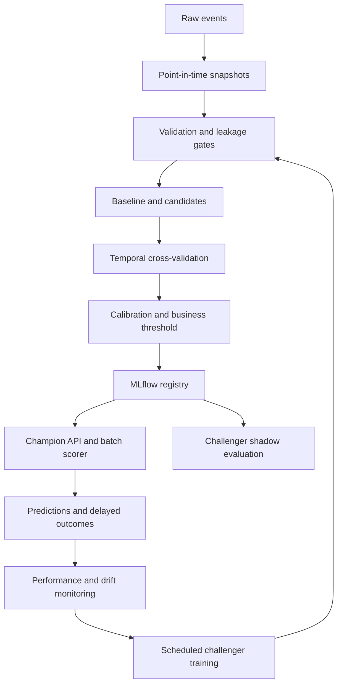

# Production ML Decision Service

A complete customer-churn decision product demonstrating conventional machine learning, economic threshold selection, batch and real-time inference, model governance, drift monitoring, and scheduled challenger training.

This is a decision service—not merely a prediction endpoint. It converts calibrated churn probabilities into retention actions subject to weekly intervention capacity, minimum precision, and financial-value constraints.

## Included capabilities

- Immutable, checksummed training snapshots and dataset manifests
- Schema, range, duplicate, and point-in-time leakage checks
- Constant/business context plus logistic-regression baseline
- Logistic regression, random forest, and histogram gradient boosting candidates
- Expanding-window temporal cross-validation
- Class weighting for imbalance and PR-AUC model selection
- Held-out sigmoid probability calibration
- SHAP global explanation report
- Capacity- and cost-constrained threshold optimization
- FastAPI real-time and bounded batch endpoints
- Offline batch-ranking workflow with capacity enforcement
- MLflow experiment tracking and model registry
- Champion, challenger, and rollback aliases
- Human-approved promotion with quality gates and audit fields
- Feature drift reports using PSI and total-variation distance
- Scheduled monthly challenger retraining
- PostgreSQL prediction/outcome history
- Prometheus application metrics and a status dashboard
- Unit, integration, leakage, drift, and economic-policy tests

## Architecture



## Quick start with Docker Compose

Prerequisites: Docker Desktop or Docker Engine with Compose.

```bash
docker compose up --build
```

The first startup trains and registers an initial champion before the API becomes available.

Open:

- Decision dashboard and API: http://localhost:8004
- Interactive API documentation: http://localhost:8004/docs
- MLflow experiments and registry: http://localhost:5004
- Prometheus-format metrics: http://localhost:8004/metrics

Stop the environment:

```bash
docker compose down
```

Add `-v` only if you intentionally want to delete database, registry, model, and report volumes.

## Local development

```bash
python -m venv .venv
source .venv/bin/activate        # Windows PowerShell: .venv\Scripts\Activate.ps1
pip install -e ".[dev]"
export MLFLOW_TRACKING_URI=sqlite:///mlflow.db
python -m ml.train --promote-initial
uvicorn app.main:app --reload
```

On Windows PowerShell, use:

```powershell
$env:MLFLOW_TRACKING_URI = "sqlite:///mlflow.db"
python -m ml.train --promote-initial
uvicorn app.main:app --reload
```

Current MLflow releases place the legacy filesystem tracking backend in
maintenance mode, so SQLite is used for local experiment tracking and model
registration.

Run tests:

```bash
pytest -q
ruff check .
```

## Example real-time prediction

```bash
curl -X POST http://localhost:8004/v1/predict \
  -H "Content-Type: application/json" \
  -d '{
    "customer_id": "C-1042",
    "tenure_months": 4,
    "monthly_charge": 115.0,
    "support_calls_30d": 5,
    "payment_failures_90d": 2,
    "usage_change_30d": -0.40,
    "late_payments_12m": 3,
    "contract_type": "month-to-month",
    "payment_method": "check",
    "region": "south"
  }'
```

The response contains a calibrated probability, operational decision, threshold, model and dataset versions, prediction ID, timestamp, and human-readable reason codes. The model-level SHAP report is stored with the training reports. Reason codes must not be described as causal explanations.

## Batch inference

Create a representative current population and score it:

```bash
python -m scripts.generate_current_data
python -m scripts.batch_score \
  --input data/current_customers.csv \
  --output reports/batch_scores.csv
```

The scorer ranks customers by risk and limits `contact` decisions to the configured operational capacity.

## Threshold economics

The service optimizes:

```text
net value = true positives × save probability × retained margin
            − contacted customers × intervention cost
```

subject to:

```text
contacted customers <= intervention capacity
precision >= minimum acceptable precision
```

Defaults:

| Assumption | Value |
|---|---:|
| Weekly capacity | 1,500 |
| Minimum precision | 0.25 |
| Retained margin | $300 |
| Successful-save probability | 25% |
| Intervention cost | $12 |

These values are examples, not claims. Change them through environment variables and perform sensitivity analysis. Predictive performance alone does not prove intervention impact; a production rollout should retain a randomized control group.

Training generates:

- `reports/candidate_comparison.csv`
- `reports/threshold_analysis.csv`
- `reports/test_metrics.json`
- `reports/shap_report.json`

## Model promotion

Scheduled retraining creates `artifacts/challenger.json`. It never changes production automatically.

After evaluating the challenger, promote it with an accountable identity and reason:

```bash
python -m ml.promote \
  --candidate artifacts/challenger.json \
  --approved-by "model-risk-reviewer@example.com" \
  --reason "Passed temporal, calibration, value, latency, and segment gates"
```

Promotion:

1. Re-runs minimum metric gates.
2. Copies the current champion to the rollback alias.
3. Writes approval identity, timestamp, and reason.
4. Reassigns the MLflow `champion` alias when a registry version exists.
5. Allows the API to reload the new model without rebuilding its container.

For a real organization, place this operation behind authenticated CI approval and role-based access rather than a shared shell.

### MLflow/skops model trust

MLflow stores the calibrated sklearn model using its safer `skops` format. The
training workflow uses an explicit allowlist for the internal calibration,
NumPy dtype, and tree-storage types created by its locally trained candidate
models. Do not replace this narrow, reviewed allowlist with every type returned
by `get_untrusted_types()` and do not use it to load model artifacts from an
untrusted source.

## Drift monitoring

```bash
python -m monitoring.monitor \
  --reference data/training_snapshot.csv \
  --current data/current_customers.csv \
  --output reports/drift_report.json
```

Numeric features use Population Stability Index. Categorical features use total-variation distance. An alert is raised when at least two features cross their configured boundaries.

Drift should trigger investigation. It is neither necessary nor sufficient evidence of model-performance degradation. Once delayed labels are available, calculate PR-AUC, calibration, precision, recall, net value, and segment performance on production predictions.

## ML and business metrics

| ML metrics | Business and operational metrics |
|---|---|
| PR-AUC and ROC-AUC | Selected customers and capacity utilization |
| Precision, recall, and F1 | Churners captured |
| Log loss and Brier score | Expected retained customers |
| Calibration | Intervention cost and net value |
| Fold mean and variability | Cost per successful retention |
| Segment performance | Incremental lift versus control policy |
| p50/p95 API latency | Prediction volume, errors, and outcome maturity |

## Production hardening checklist

- Replace synthetic data with point-in-time-correct warehouse snapshots.
- Add authentication, authorization, encryption, and secrets management.
- Prevent sensitive attributes from entering logs or explanations.
- Add group-specific error, calibration, and intervention-rate reviews.
- Validate that intervention itself does not create unfair treatment.
- Run the challenger in shadow mode before allocating decision traffic.
- Add a randomized holdout to estimate incremental treatment effect.
- Back up the registry, database, artifacts, and approval records.
- Define rollback objectives, label-maturity windows, and incident procedures.
- Load-test the service against explicit latency and availability SLOs.

## Important modeling limitations

The included dataset is synthetic and proves the engineering workflow, not real commercial accuracy. SHAP describes model behavior rather than causality. Expected financial value depends on uncertain assumptions, especially the probability that outreach prevents churn. Automated retraining intentionally creates only a challenger because passing offline metrics is not enough to justify changing live decisions.
